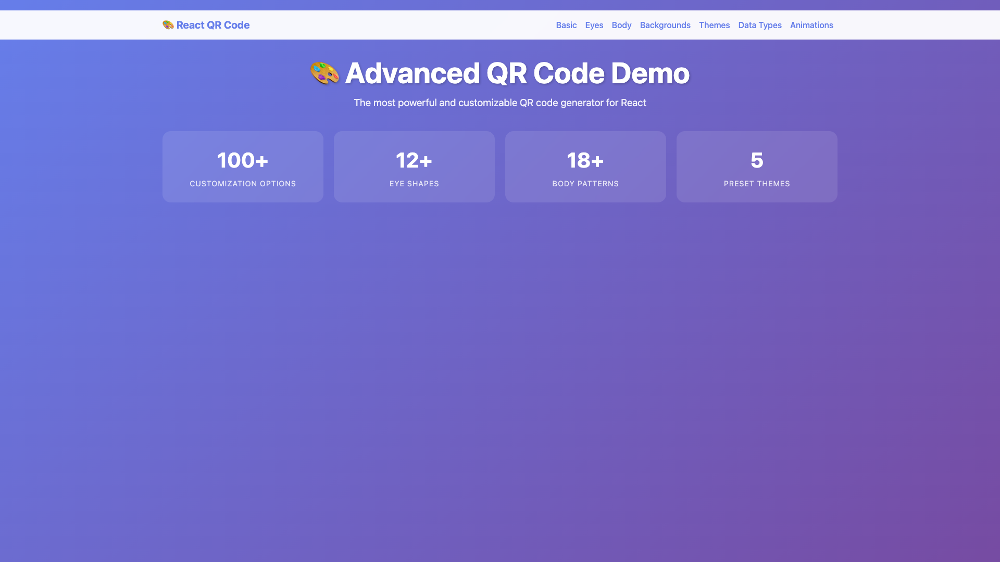
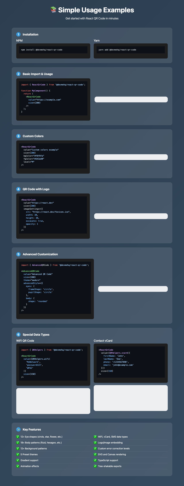
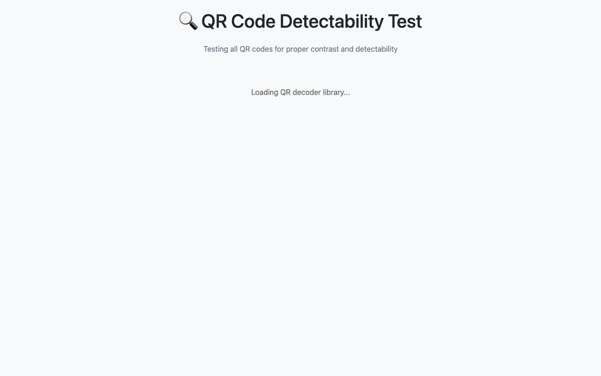

# React QR Code Examples 🎨

Comprehensive examples demonstrating all features of @devmehq/react-qr-code.



## 📁 Files Overview

### 🏠 [index.html](index.html) + [app.jsx](app.jsx)
**Main Demo Page**
- Basic and advanced QR code examples
- Links to all other demos
- Perfect starting point for exploring the library

### 🎨 [advanced-demo.html](advanced-demo.html) + [advanced-demo.jsx](advanced-demo.jsx)
**Complete Feature Showcase**
- **100+ customization examples**
- Eye customization (12+ shapes)
- Body patterns (18+ shapes)
- Background patterns (12+ types)
- All 5 preset themes
- Data type examples (WiFi, vCard, SMS, etc.)
- Animation and effects
- **Best for seeing all possibilities**

### 📚 [simple-usage.html](simple-usage.html)
**Developer Getting Started Guide**
- Step-by-step installation
- Basic usage examples with code
- Common use cases
- **Best for developers getting started**

### 📖 [api-docs.html](api-docs.html)
**Complete API Documentation**
- All props and interfaces
- Method documentation
- TypeScript definitions
- Complete code examples
- **Best for API reference**

## 🚀 Quick Start

### Option 1: View Online
- [CodeSandbox Playground](https://codesandbox.io/s/react-qr-code-demo-ccho5l)
- [StackBlitz Demo](https://stackblitz.com/edit/react-qr-code-demo)

### Option 2: Run Locally

```bash
# From the react-qr-code root directory
yarn build
cd examples

# Choose your server:
npx http-server -o          # npm (recommended)
python3 -m http.server 8080  # Python
php -S localhost:8080        # PHP
```

Then open your browser to:
- Main Demo: `http://localhost:8080/`
- Advanced Examples: `http://localhost:8080/advanced-demo.html`
- API Docs: `http://localhost:8080/api-docs.html`

## 🌟 Features Demonstrated

### Basic Features
- ✅ Custom colors and sizes
- ✅ Logo/image embedding
- ✅ Error correction levels
- ✅ SVG and Canvas rendering
- ✅ Margin control

### Advanced Features
- ✅ **12+ Eye Shapes**: circle, star, flower, heart, diamond, leaf, hexagon, etc.
- ✅ **18+ Body Patterns**: fluid, hexagon, circle, diamond, star, mosaic, etc.
- ✅ **12+ Background Patterns**: dots, waves, grid, hexagons, stars, etc.
- ✅ **Color Effects**: shadow, glow, neon, holographic, chrome, 3D, etc.
- ✅ **Gradients**: linear, radial, conic with multiple stops
- ✅ **Animations**: fade-in, scale, rotate, bounce, pulse, etc.
- ✅ **5 Preset Themes**: modern, neon, vintage, cyberpunk, nature

### Data Types
- ✅ **WiFi Networks**: Auto-connect QR codes
- ✅ **Contact vCards**: Phone, email, address, organization
- ✅ **SMS Messages**: Pre-filled text messages
- ✅ **Emails**: With subject and body
- ✅ **Geographic Locations**: GPS coordinates
- ✅ **Calendar Events**: Meeting invitations
- ✅ **Phone Numbers**: Direct dial
- ✅ **URLs and Text**: Basic data types

## 🎯 Example Use Cases

### Business Cards
```javascript
<ReactQrCode 
  value={QRHelpers.vcard({
    firstName: 'John',
    lastName: 'Doe',
    phone: '+1234567890',
    email: 'john@company.com',
    organization: 'Tech Corp'
  })}
  theme="modern"
  size={200}
/>
```

### WiFi Sharing
```javascript
<ReactQrCode 
  value={QRHelpers.wifi('MyWiFi', 'password123', 'WPA2')}
  theme="cyberpunk"
  size={200}
/>
```

### Event Invitations
```javascript
<ReactQrCode 
  value={QRHelpers.event({
    summary: 'Team Meeting',
    startDate: new Date('2024-03-15T10:00:00'),
    location: 'Conference Room A'
  })}
  theme="nature"
  size={200}
/>
```

### Branded QR Codes
```javascript
<AdvancedQRCode 
  value="https://mycompany.com"
  size={300}
  advancedStyle={{
    eyes: {
      frameShape: 'rounded',
      frameColor: '#your-brand-color'
    },
    body: {
      shape: 'rounded',
      color: '#your-brand-color'
    }
  }}
  imageSettings={{
    src: '/logo.png',
    excavate: true
  }}
/>
```

## 📸 Screenshots Gallery

<table>
  <tr>
    <td align="center">
      
      <br><b>Interactive Demo</b>
    </td>
    <td align="center">
      
      <br><b>Simple Usage</b>
    </td>
  </tr>
  <tr>
    <td align="center">
      
      <br><b>Detectability Test</b>
    </td>
    <td align="center">
      
      <br><b>Advanced Styles</b>
    </td>
  </tr>
</table>

## 🔧 Development

### Live Reload Development

```bash
# Terminal 1: Watch and rebuild
yarn build:watch

# Terminal 2: Serve with live reload
npx live-server examples
```

### Testing QR Detectability

```bash
# Run detectability tests
node test-detectability.js

# Run E2E tests
node ../test/e2e-svg-detectability.js
```

### Mobile Testing

```bash
# Start server on all interfaces
http-server examples --host 0.0.0.0

# Access from mobile:
# http://[YOUR-LOCAL-IP]:8080
```

## 🧪 Testing & Validation

### QR Code Detectability
All generated QR codes are tested for:
- ✅ Minimum 3:1 contrast ratio
- ✅ Proper error correction
- ✅ Scanner compatibility
- ✅ Mobile camera detection

### Supported Scanners
- iOS Camera (iOS 11+)
- Android Camera
- Google Lens
- QR Scanner apps
- Web-based scanners

## 📖 Documentation Links

- [Full Examples Documentation](../EXAMPLES.md)
- [Main Repository](https://github.com/devmehq/react-qr-code)
- [NPM Package](https://www.npmjs.com/package/@devmehq/react-qr-code)
- [API Reference](../README.md#api-reference)
- [TypeScript Definitions](../src/types/)
- [Contributing Guide](../CONTRIBUTING.md)

## 🤝 Contributing

Found an example that could be improved or want to add a new use case? Feel free to:

1. Fork the repository
2. Add your example
3. Submit a pull request

## 📄 License

These examples are part of the React QR Code library and are licensed under the same terms as the main library.

---

**Happy coding! 🎉** Start with `index.html` to see the overview, then dive into `advanced-demo.html` for the full feature showcase!